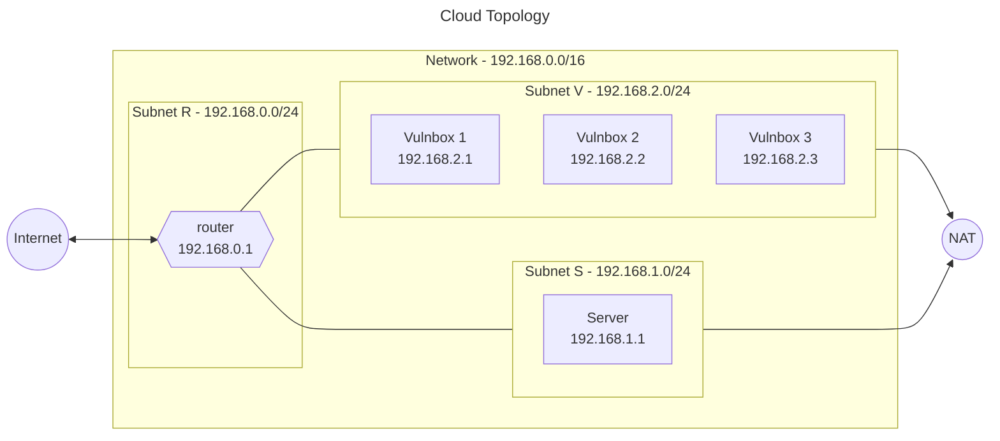
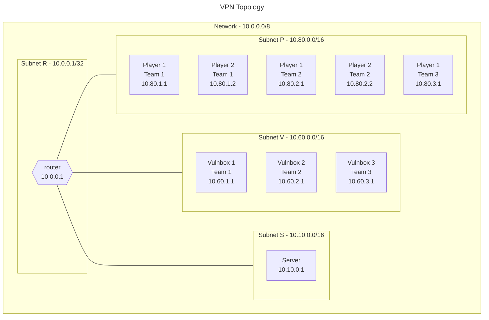

# Infrastructure As Code - Attack/Defense

## Introduction

This repository contains the code for the Infrastructure As Code - Attack/Defense project.
The goal of this project is to create a complete infrastructure, able to host an Attack/Defense challenge, using Infrastructure As Code (IaC) tools.  
The provisioning is handled by Terraform and the machine configuration is handled by Ansible.

## Requirements

- [Python3 3.7+](https://www.python.org/)
- [Terraform](https://developer.hashicorp.com/terraform)
- [Ansible](https://www.ansible.com/)

Depending on the provider you want to use, you may need to install the corresponding CLI to handle the authentication.

- [AWS CLI](https://aws.amazon.com/cli/)
- [Azure CLI](https://docs.microsoft.com/en-us/cli/azure/install-azure-cli?view=azure-cli-latest)
- [Google Cloud SDK](https://cloud.google.com/sdk/docs/quickstarts)
- [OpenStack CLI](https://docs.openstack.org/newton/user-guide/common/cli-install-openstack-command-line-clients.html)

Running ansible and the _run.py_ script require installing some dependencies via pip.
All requirements are listed in the _requirements.txt_ file.
The installation can be either system-wide or in a virtual environment.

```shell
pip3 install -r requirements.txt
```

## Topology





## Configuration

### Terraform

The suggested way to configure Terraform is creating a _terraform.tfvars_ file in the _terraform/\<provider\>_ folder.

A list of all the variables that can be configured can be found in the _variables.tf_ file in the same folder.

### Ansible

The suggested way to configure Ansible is creating an _inventory.yml_ file in the _ansible_ folder.

See the _inventory.yml.example_ file for an example.

Furthermore, all the vulnerable services the vulnboxes will run can be added in the _ansible/services_ folder.
Each subfolder represents a service and is expected to contain a _start.sh_ script that will be executed to start the service.  
Similarly, the _ansible/checkers_ folder can be used to add checkers for the services.
The checkers must be written in the hackerdom style.  
For more information, check the [ForcAD](https://github.com/pomo-mondreganto/ForcAD) documentation.

Some examples have been provided in the _examples_ folder.  
Those are taken from [CybersecNatLab](https://github.com/CybersecNatLab/CybersecNatLab-AD-Demo/tree/master), adjusted for compatibility.
All credits go to the original authors.

## Usage

### Using the script

In the root of the project, there are two scripts, called _run.sh_ and _run.py_.
Both support the same functions, and are meant to simplify the usage of Terraform and Ansible with this project.  
The _run.sh_ script may be faster, but it requires Bash
The _run.py_ script requires Python3, but is more portable and has more features.

For a more in depth explanation of the commands, run the script with the _-h_ flag.

````shell
# Show the help
./run.py -h

```shell
# Run all the commands in sequence to create the infrastructure
./run.py all -p <provider>
````

#### Singular commands

```shell
# Create the infrastructure
./run.py terraform init -p <provider>
```

```shell
# Create the infrastructure
./run.py terraform apply -p <provider>
```

```shell
# Destroy the infrastructure
./run.py terraform destroy -p <provider>
```

```shell
# Using the outputs from Terraform to configure
# hosts and private keys
./run.py terraform out -p <provider>
```

```shell
# Adds all the remote hosts to the known hosts
./run.py connect fingerprint
```

```shell
# Starts the setup process on all the hosts
./run.py ansible playbook
```

```shell
# Bootstraps wireguard on all the hosts
./run.py ansible up
```

```shell
# Shuts down wireguard on all the hosts
./run.py ansible down
```

### Manual setup

Although the _run.sh_ script is the recommended way to use this project, it is possible to use Terraform and Ansible manually.
Make sure the working directory is the correct one before running the commands.

#### Terraform

Folder _terraform/\<provider\>_.

```shell
# Initialize Terraform, download the providers and modules
terraform init
```

```shell
# Create the infrastructure
terraform apply
```

```shell
# Destroy the infrastructure
terraform destroy
```

#### Ansible

Folder _ansible_.

```shell
# Setup all the hosts
ansible-playbook -i inventory.yml main.yml
```

```shell
# Force start wireguard on all the hosts
ansible-playbook -i inventory.yml wireguard_up.yml
```

## Extra

### Autocomplete

The _run.py_ script supports autocomplete for Bash.
The autocomplete script is in the _util_ folder.
To enable it, copy it to _/etc/bash_completion.d/_.

```shell
# Copy the autocomplete script
sudo cp util/autocomplete.sh /etc/bash_completion.d/terraform-ansible
```

```shell
# You may need to source the autocomplete script
echo "source /etc/bash_completion.d/terraform-ansible" >> ~/.bashrc
```

### Connect with wireguard

After running the ansible main playbook, all the configuration files for wireguard will be in the _ansible/teams_ folder.
It is possible to use those to connect to the VPN.

```shell
# Copy the configuration file to the wireguard folder
sudo cp ansible/teams/<team_name>-<i>.conf /etc/wireguard/wg0.conf
# Connect to the VPN
sudo wg-quick up wg0
```

## Credits

- [ForcAD](https://github.com/pomo-mondreganto/ForcAD), used for the checker and services
- [CybersecNatLab](https://github.com/CybersecNatLab/CybersecNatLab-AD-Demo/tree/master), whose challenges are used as examples in this project
- [Ansible Docs](https://docs.ansible.com/ansible/latest/index.html), used for the Ansible playbooks
- [Terraform Docs](https://www.terraform.io/docs/index.html), used for the Terraform configuration
