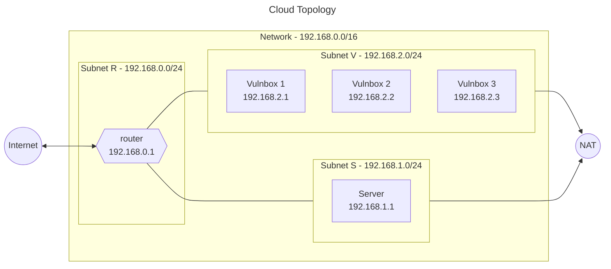
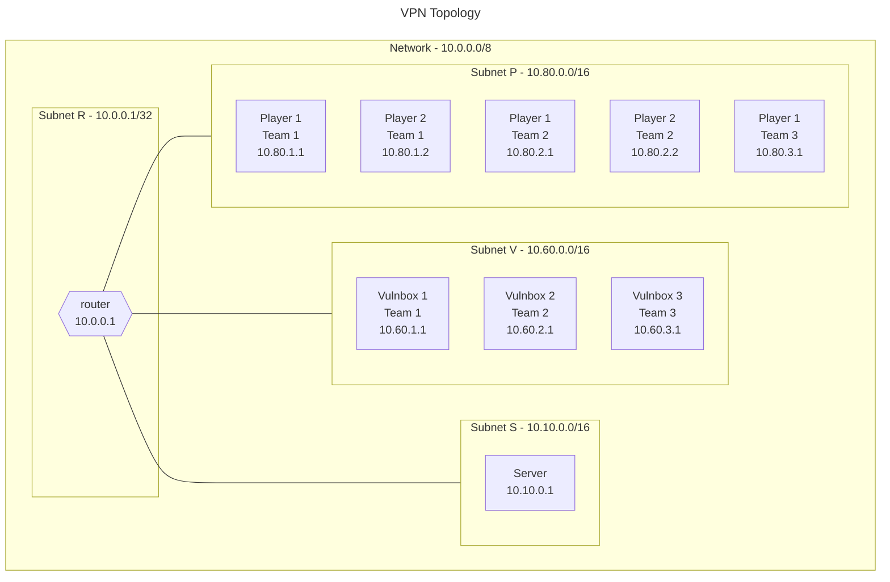

# Infrastructure As Code - Attack/Defense

## Introduction

This repository contains the code for the Infrastructure As Code - Attack/Defense project.
The goal of this project is to create a complete infrastructure, able to host an Attack/Defense challenge, using Infrastructure As Code (IaC) tools.  
The provisioning is handled by Terraform and the machine configuration is handled by Ansible.

## Requirements

- [Python3](https://www.python.org/)
- [Terraform](https://developer.hashicorp.com/terraform)
- [Ansible](https://www.ansible.com/)

Depending on the provider you want to use, you may need to install the corresponding CLI to handle the authentication.

- [AWS CLI](https://aws.amazon.com/cli/)
- [Azure CLI](https://docs.microsoft.com/en-us/cli/azure/install-azure-cli?view=azure-cli-latest)
- [Google Cloud SDK](https://cloud.google.com/sdk/docs/quickstarts)
- [OpenStack CLI](https://docs.openstack.org/newton/user-guide/common/cli-install-openstack-command-line-clients.html)

## Topology





## Configuration

### Terraform

The suggested way to configure Terraform is creating a _terraform.tfvars_ file in the _terraform/\<provider\>_ folder.  
See the _terraform.tfvars.example_ file for an example.

A list of all the variables that can be configured can be found in the _variables.tf_ file in the same folder.

### Ansible

The suggested way to configure Ansible is creating an _inventory.yml_ file in the _ansible_ folder.

See the _inventory.yml.example_ file for an example.

## Usage

### Using the run.sh script

In the root of the project, there is a script called _run.sh_.
It is used to simplify the usage of Terraform and Ansible with this project.

```shell
# Create the infrastructure
./run.sh apply -p <provider>
# Example
./run.sh apply -p aws
```

```shell
# Destroy the infrastructure
./run.sh destroy -p <provider>
# Example
./run.sh destroy -p aws
```

```shell
# Using the outputs from Terraform to configure
# hosts and private keys
./run.sh outputs -p <provider>
# Example
./run.sh outputs -p aws
```

```shell
# Setup all the hosts
./run.sh setup
```

```shell
# Force start wireguard on all the hosts
./run.sh wireguard
```

### Manual setup

Although the _run.sh_ script is the recommended way to use this project, it is possible to use Terraform and Ansible manually.
Make sure the working directory is the correct one before running the commands.

#### Terraform

Folder _terraform/\<provider\>_.

```shell
# Initialize Terraform, download the providers and modules
terraform init
```

```shell
# Create the infrastructure
terraform apply
```

```shell
# Destroy the infrastructure
terraform destroy
```

#### Ansible

Folder _ansible_.

```shell
# Setup all the hosts
ansible-playbook -i inventory.yml main.yml
```

```shell
# Force start wireguard on all the hosts
ansible-playbook -i inventory.yml wireguard_start.yml
```
