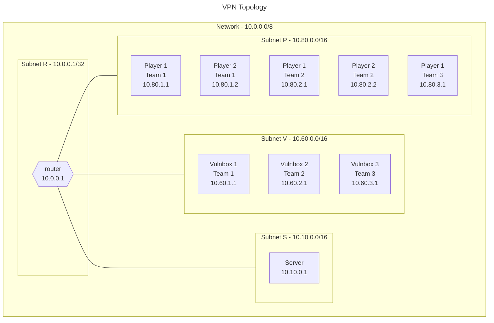

# Ansible

Ansible is an automation tool that can be used to configure and manage computers.
It is used in this project to configure the hosts and to set up the Wireguard VPN.

## Requirements

- [Python](https://www.python.org/downloads/) >= 3.7
- [Ansible](https://www.ansible.com/)

All the requirements can be installed with the following command:

```shell
pip3 install -r requirements.txt
```

## Directory structure

The Ansible directory is structured as follows:

```shell
ansible
├── checkers
│   └── ...
├── keys
│   └── ...
├── filter_plugins
│   └── ...
├── services
│   └── ...
├── templates
│   └── ...
├── tasks
│   └── ...
├── inventory.yml
├── main.yml
├── wireguard_down.yml
└── wireguard_up.yml
```

The configuration is split into multiple files to make it easier to manage and to reuse.  
The keys provided in the _keys_ directory are used to connect to the hosts.

The setup starts from the _main.yml_ file.
In this process, some templates are used to create the wireguard configuration files and the ForkAD server configuration file.  
The wireguard configuration files will also be put in the _teams_ directory, to be sent to the teams.

The services directory contains the vulnerable services to be uploaded to the vulnerable hosts.
Every service is expected to contain a _start.sh_ script that will be used to start the service.

The _checkers_ directory contains the checkers to be uploaded to the server.
As soon as the game starts and the network is opened, the server will start the checkers to make sure the SLA is respected.

The _wireguard_up.yml_ and _wireguard_down.yml_ files are used to start and stop the Wireguard VPN as fast as possible.

## Configuration

The configuration is done in the _inventory.yml_ file.
It contains the list of hosts and their configuration, as well as other details about the competition, such as the start and end time and the VPN configuration.

The _inventory.yml.example_ file contains an example configuration.

```yaml
all:
  children:
    vulnbox:
      hosts:
        vulnbox1:
          ansible_host: 192.168.2.5 # private ip of the vulnbox
          ansible_ssh_common_args: -o ProxyCommand="ssh -i ./keys/router.pem -W %h:%p  ubuntu@20.126.31.170" # used to connect to the vulnbox through the router
          ansible_ssh_private_key_file: ./keys/vulnbox1.pem # private key to connect to the vulnbox
          ansible_user: ubuntu
        vulnbox2:
          ansible_host: 192.168.2.4 # private ip of the vulnbox
          ansible_ssh_common_args: -o ProxyCommand="ssh -i ./keys/router.pem -W %h:%p  ubuntu@20.126.31.170" # used to connect to the vulnbox through the router
          ansible_ssh_private_key_file: ./keys/vulnbox2.pem # private key to connect to the vulnbox
          ansible_user: ubuntu
  hosts:
    router:
      ansible_host: 20.126.31.170 # public ip of the router
      ansible_ssh_private_key_file: ./keys/router.pem # private key to connect to the router
      ansible_user: ubuntu
    server:
      ansible_host: 192.168.1.4 # private ip of the server
      ansible_ssh_common_args: -o ProxyCommand="ssh -i ./keys/router.pem -W %h:%p  ubuntu@20.126.31.170" # used to connect to the server through the router
      ansible_ssh_private_key_file: ./keys/server.pem # private key to connect to the server
      ansible_user: ubuntu
  vars:
    ad:
      default_score: 2500 # default score of a service
      flag_lifetime: 5 # number of rounds a flag is valid
      round_time: 60 # duration of a round in seconds
      timezone: Europe/Rome # timezone of the competition, used to calculate the start and end time
      vulnbox:
        services_owner: root # owner of the services on the vulnbox
        services_path: /root/services/ # path where the services are located on the vulnbox
    teams: # list of teams. Each team has a name and a number of players
      - name: catania
        players: 1
      - name: palermo
        players: 2
    wireguard:
      network: 10.0.0.0/8 # network used for the VPN
      player:
        ip_format: 10.80.%d.%d # format of the ip of the players. The first is the team number, the second is the player number
        subnet: 10.80.0.0/16 # subnet used for the VPN
        team_mask_offset: 8 # offset of the team number in the ip
      router:
        ip: 10.0.0.1 # ip of the router
        open: # time when the VPN is opened, meaning the teams can start attacking
          day: 15
          hour: 12
          minute: 15
          month: 7
          year: 2023
        port: 51820 # port used for the VPN
        private_ip: 192.168.0.4 # private ip of the router
        start: # time when the VPN is started. The teams can connect to the VPN, but only their resources are available
          day: 15
          hour: 12
          minute: 10
          month: 7
          year: 2023
        subnet: 10.0.0.1/32 # router's subnet in the VPN
      server:
        ip: 10.10.0.1 # ip of the server in the VPN
        port: 51820 # port used for the VPN
        subnet: 10.10.0.0/16 # server's subnet in the VPN
      vulnbox:
        ip_format: 10.60.%d.1 # format of the ip of the vulnboxes. The first is the team number
        port: 51820 # port used for the VPN
        subnet: 10.60.0.0/16 # vulnbox's subnet in the VPN
        team_mask_offset: 8 # offset of the team number in the ip
```

## Topology

The topology of the VPN network is the following:



All the players connect to the router, which routes the traffic to the server and the vulnboxes accordingly.  
Until the network is opened, the router only routes the traffic of the team that owns the vulnbox or the player, and to the server.  
When the network is opened, all vulnboxes and players can communicate with each other.

The router also applies SNAT to the traffic coming from the players and the vulnboxes, so that defending vulnboxes sees the traffic as coming from the router.

## Usage

> It is recommended to use the run.py script.
> Check the [usage page](./Usage.md) for more information.

To run the playbook, use the following command:

```bash
ansible-playbook -i inventory.yml main.yml
```

To up the VPN, use the following command:

```bash
ansible-playbook -i inventory.yml wireguard_up.yml
```

To down the VPN, use the following command:

```bash
ansible-playbook -i inventory.yml wireguard_down.yml
```
