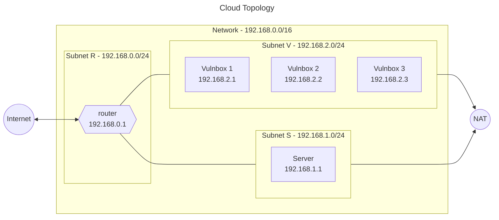

# Terraform

Terraform is a tool for building, changing, and versioning infrastructure safely and efficiently.
It comes with standard plugins to manage existing and popular service providers.

## Requirements

- [Terraform](https://www.terraform.io/downloads.html) >= 1.5.2

## Directory structure

This project supports multiple cloud providers, including AWS, Azure, and Openstack.
Each cloud provider has its own directory inside the _terraform_ directory in the root of the project.

The structure of each cloud provider directory is as follows:

```bash
provider
├── modules
│   ├── network
│   │   ├── network.tf
│   │   ├── network-outputs.tf
│   │   └── network-variables.tf
│   ├─ router
│   │   ├── router.tf
│   │   ├── router-outputs.tf
│   │   └── router-variables.tf
│   ├─ vulnbox
│   │   ├── vulnbox.tf
│   │   ├── vulnbox-outputs.tf
│   │   └── vulnbox-variables.tf
│   └─ server
│       ├── server.tf
│       ├── server-outputs.tf
│       └── server-variables.tf
├── main.tf
└── variables.tf
```

The _main.tf_ file is the entry point for the Terraform configuration.
It contains the provider configuration.
It then calls the modules found in the _modules_ directory and passes the variables to them e among them.  
The _variables.tf_ file contains both required and optional variables the script accepts.

## Configuration

Providing a value for the variables allows to personalize the infrastructure to one's needs.

While it is possible to provide the variable when using the _terraform apply_ command, it is recommended to create a _terraform.tfvars_ file in the same directory as the _main.tf_ file.

```conf
# terraform.tfvars example
iac_ad_vulnbox_image_id      = "ami-053b0d53c279acc90"
iac_ad_vulnbox_instance_type = "t2.medium"
iac_ad_router_image_id       = "ami-053b0d53c279acc90"
iac_ad_router_instance_type  = "t2.micro"
iac_ad_server_image_id       = "ami-053b0d53c279acc90"
iac_ad_server_instance_type  = "t2.micro"
iac_ad_vulnbox_count         = 2
iac_ad_server_ports          = [22, 80, 443]
```

## Authentication

To interact with the clod provider of your choice, you need to provide a way for terraform to authenticate.
This is usually done by installing the command line tools provided by the cloud provider and then following a certain procedure to generate the credentials.

### AWS

- [AWS CLI](https://docs.aws.amazon.com/cli/latest/userguide/cli-chap-install.html)
- [AWS CLI configuration](https://docs.aws.amazon.com/cli/latest/userguide/cli-configure-quickstart.html)
- [Terrafom AWS provider](https://registry.terraform.io/providers/hashicorp/aws/latest/docs)

### Azure

- [Azure CLI](https://docs.microsoft.com/en-us/cli/azure/install-azure-cli)
- [Azure CLI configuration](https://docs.microsoft.com/en-us/cli/azure/authenticate-azure-cli)
- [Terraform Azure provider](https://registry.terraform.io/providers/hashicorp/azurerm/latest/docs)

### Openstack

- [Openstack CLI](https://docs.openstack.org/python-openstackclient/latest/)
- [Openstack CLI configuration](https://docs.openstack.org/python-openstackclient/latest/configuration/index.html)
- [Terraform Openstack provider](https://registry.terraform.io/providers/terraform-provider-openstack/openstack/latest/docs)

## Topology



All the scripts in this project will create a network with the following topology:

- A router with a public IP address and a private IP address in the subnet _192.168.0.0/24_.
- A server with a private IP address in the subnet _192.168.1.0/24_.
- A variable number of vulnboxes with private IP addresses in the subnet _192.168.2.0/24_.

Furthermore, a security group will make sure that both server and vulnboxes only accept connections coming from the router.  
They can still connect to the internet using a NAT gateway.

## Usage

> It is recommended to use the run.py script.
> Check the [usage page](./Usage.md) for more information.

All commands should be run from the directory of the cloud provider you want to use.  
The first step is to initialize terraform by installing the required provider.

```bash
terraform init
```

Then, you can check the changes that will be applied to the infrastructure by running the following command.

```bash
terraform plan
```

Finally, you can apply the changes to the infrastructure by running the following command.

```bash
terraform apply
```

## Destroy

To destroy the infrastructure, run the following command.

```bash
terraform destroy
```
